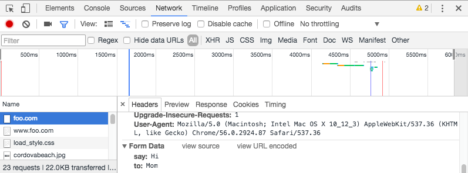

# 05-发送表单数据

> HTML 表单本质上是一种方便用户配置 HTTP 请求, 向服务器发送数据的方式.

---

## 客户端定义如何发送数据

决定 `<form>` 元素如何发送数据的两个最重要的属性是 `action`, `method`.

### action

`action` 属性定义了表单数据发往的地址, 必须是相对或绝对 URL. 如果 `action` 为空, 则发往当前页面的 URL.

```html
<!-- 发往绝对 URL -->
<form action="https://example.com">…</form>

<!-- 发往和当前页面同域名的 URL -->
<form action="/somewhere_else">…</form>

<!-- 发往当前页面的 URL -->
<form>…</form>
```

### method

`method` 属性定义了数据发往服务器的方式, 常用值有 `GET`, `POST`.

#### GET

`GET` 方法被设计用来向服务器请求资源, 其请求体为空. 所以如果使用 `GET` 发送表单数据, 需要将控件的键值对附加到 URL 之后.

- `action` 属性指定的 URL 和键值对之间用 `?` 分隔.
- 键值以 `=` 连接, 形成键值对.
- 键值对之间用 `&` 分隔.

```html
<!-- 这个表单提交后, 浏览器跳转到 http://foo.com/?say=Hi&to=Mom -->
<form action="http://www.foo.com" method="GET">
    <div>
        <label for="say">What greeting do you want to say?</label>
        <input name="say" id="say" value="Hi">
    </div>
    <div>
        <label for="to">Who do you want to say it to?</label>
        <input name="to" id="to" value="Mom">
    </div>
    <div>
        <button>Send my greetings</button>
    </div>
</form>
```

生成的 HTTP 请求类似这样:

```http
GET /?say=Hi&to=Mom HTTP/2.0
Host: foo.com
```

#### POST

`POST` 方法被设计用来向服务器发送资源, 然后等待服务器返回的响应. 所以如果使用 `POST` 发送表单数据, 控件的键值对会被包含在请求体里, 不需要附加到 URL.

```html
<!-- 这个表单提交后, 浏览器跳转到 http://foo.com -->
<form action="http://www.foo.com" method="GET">
    <div>
        <label for="say">What greeting do you want to say?</label>
        <input name="say" id="say" value="Hi">
    </div>
    <div>
        <label for="to">Who do you want to say it to?</label>
        <input name="to" id="to" value="Mom">
    </div>
    <div>
        <button>Send my greetings</button>
    </div>
</form>
```

生成的 HTTP 请求类似这样:

```http
POST / HTTP/2.0
Host: foo.com
Content-Type: application/x-www-form-urlencoded
Content-Length: 13

say=Hi&to=Mom
```

### 查看 HTTP 请求

可以在浏览器的开发者工具里查看发送的 HTTP 请求. 以 Chrome 为例, `开发者工具 -> Network -> All -> 选中想查看的域名`, 如图:



- 如果表单里有敏感数据 (如密码), 则不能使用 `GET`, 否则密码会暴露在浏览器地址栏.
- 如果数据量比较大, 则应选用 `POST`, 因为 URL 长度受限.

---

## 服务器检索数据

服务器会解析出客户端传来的数据中的键值对, 然后可以根据需要进一步处理键值对, 例如保存到数据库.

PHP 直接使用全局变量 `$_POST`, `$_GET` 检索收到的数据中的键值对.

```php
<?php
// 全局变量 `$_POST` 用于访问通过 POST 方法发来的数据.
// 全局变量 `$_GET` 用于访问通过 GET 方法发来的数据.
$say = htmlspecialchars($_POST['say']);
$to  = htmlspecialchars($_POST['to']);

echo  $say, ' ', $to;
?>
```

---

## 发送文件

文件是二进制数据, 而 HTTP 是一种文本协议, 所以得特殊处理.

元素 `<form>` 的属性 `enctype` (encoding type, 编码类型) 用于指定 HTTP 请求头中的 `Content-Type`. 服务器通过 `Content-Type` 的值知道接收的数据的类型.

如果想通过表单发送文件给服务器, 需要做到以下 3 点:

- `method="POST"`.
- `enctype="multipart/form-data"`: 表单数据会被分成多个部分, 每个二进制文件是一个部分, 所有文本数据合起来是一个部分.
- 在表单中添加控件 `<input type="file">`.

```html
<form method="post" action="https://www.foo.com" enctype="multipart/form-data">
    <div>
        <label for="file">Choose a file</label>
        <input type="file" id="file" name="myFile">
    </div>
    <div>
        <button>Send the file</button>
    </div>
</form>
```

> ⚠️ 服务器可以配置限制文件和 HTTP 请求的大小, 以防止滥用.


---

?> {docsify-updated}